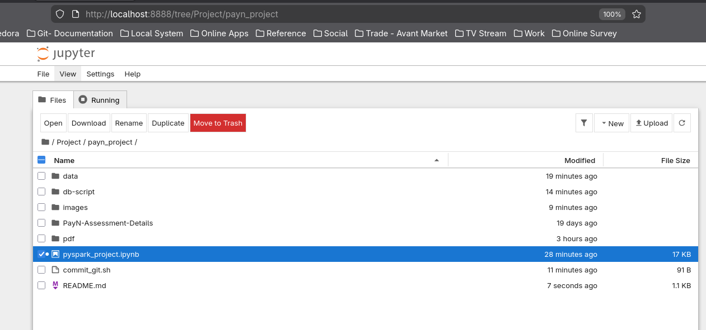
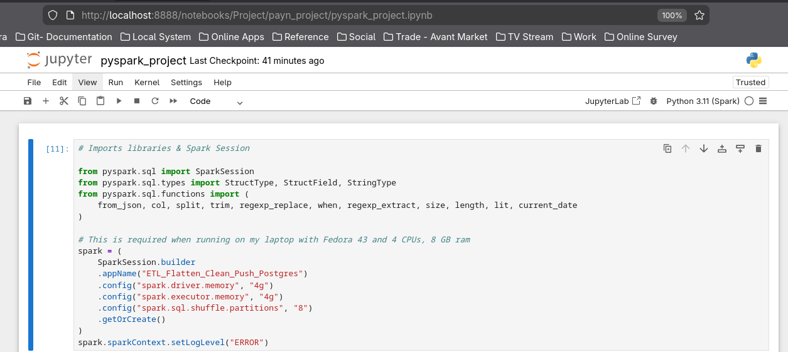
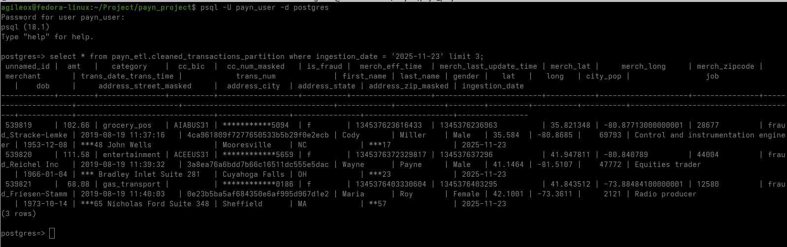

# payn_project
## Project Description:
This is a project to learn how to flatten JSON file with 1.2 Million rows, process it and transform to make sure PII data has been masked properly and ingest the data into local postgresql for next dashboarding activities.

## Method:
- Read and flatten JSON file
- Clean names by split first name and last name
- Normalize gender
- Mask credit card (keep last 4 digits), address street and address zip for keeping PII data safe
- Push final dataFrame into PostgreSQL

## Tools:
+ Fedora 43
+ PySpark 3.11 (spark)
+ Free Jupyter Notebook
+ PostgreSQL 18
+ Superset

### Jupyter Notebook


### The pyspark script


### The sample data source in json format
```json
{"Unnamed: 0":"0","trans_date_trans_time":"2019-01-01 00:00:18","cc_bic":"CITIUS33CHI","cc_num":"2703186189652095","merchant":"fraud_Rippin, Kub and Mann","category":"misc_net","amt":"4.97","personal_detail":"{\"person_name\":\"Jennifer,Banks,eeeee\",\"gender\":\"F\",\"address\":\"{\\\"street\\\":\\\"561 Perry Cove\\\",\\\"city\\\":\\\"Moravian Falls\\\",\\\"state\\\":\\\"NC\\\",\\\"zip\\\":\\\"28654\\\"}\",\"lat\":\"36.0788\",\"long\":\"-81.1781\",\"city_pop\":\"3495\",\"job\":\"Psychologist, counselling\",\"dob\":\"1988-03-09\"}","trans_num":"0b242abb623afc578575680df30655b9","merch_lat":"36.011293","merch_long":"-82.048315","is_fraud":"0","merch_zipcode":"28705","merch_eff_time":"1325376018798532","merch_last_update_time":"1325376018666"}
{"Unnamed: 0":"1","trans_date_trans_time":"2019-01-01 00:00:44","cc_bic":"ADMDUS41","cc_num":"630423337322","merchant":"fraud_Heller, Gutmann and Zieme","category":"grocery_pos","amt":"107.23","personal_detail":"{\"person_name\":\"Stephanie,Gill,eeeee\",\"gender\":\"F\",\"address\":\"{\\\"street\\\":\\\"43039 Riley Greens Suite 393\\\",\\\"city\\\":\\\"Orient\\\",\\\"state\\\":\\\"WA\\\",\\\"zip\\\":\\\"99160\\\"}\",\"lat\":\"48.8878\",\"long\":\"-118.2105\",\"city_pop\":\"149\",\"job\":\"Special educational needs teacher\",\"dob\":\"1978-06-21\"}","trans_num":"1f76529f8574734946361c461b024d99","merch_lat":"49.159046999999994","merch_long":"-118.186462","is_fraud":"0","merch_eff_time":"1325376044867960","merch_last_update_time":"132537604479"}
{"Unnamed: 0":"2","trans_date_trans_time":"2019-01-01 00:00:51","cc_bic":"Null","cc_num":"38859492057661","merchant":"fraud_Lind-Buckridge","category":"entertainment","amt":"220.11","personal_detail":"{\"person_name\":\"Edward@Sanchez\",\"gender\":\"M\",\"address\":\"{\\\"street\\\":\\\"594 White Dale Suite 530\\\",\\\"city\\\":\\\"Malad City\\\",\\\"state\\\":\\\"ID\\\",\\\"zip\\\":\\\"83252\\\"}\",\"lat\":\"42.1808\",\"long\":\"-112.262\",\"city_pop\":\"4154\",\"job\":\"Nature conservation officer\",\"dob\":\"1962-01-19\"}","trans_num":"a1a22d70485983eac12b5b88dad1cf95","merch_lat":"43.150704","merch_long":"-112.154481","is_fraud":"0","merch_zipcode":"83236","merch_eff_time":"1325376051506840","merch_last_update_time":"1325376051286"}
{"Unnamed: 0":"3","trans_date_trans_time":"2019-01-01 00:01:16","cc_bic":"DEUTUS33TRF","cc_num":"3534093764340240","merchant":"fraud_Kutch, Hermiston and Farrell","category":"gas_transport","amt":"45.0","personal_detail":"{\"person_name\":\"Jeremy/White, !\",\"gender\":\"M\",\"address\":\"{\\\"street\\\":\\\"9443 Cynthia Court Apt. 038\\\",\\\"city\\\":\\\"Boulder\\\",\\\"state\\\":\\\"MT\\\",\\\"zip\\\":\\\"59632\\\"}\",\"lat\":\"46.2306\",\"long\":\"-112.1138\",\"city_pop\":\"1939\",\"job\":\"Patent attorney\",\"dob\":\"1967-01-12\"}","trans_num":"6b849c168bdad6f867558c3793159a81","merch_lat":"47.034331","merch_long":"-112.561071","is_fraud":"0","merch_eff_time":"1325376076794698","merch_last_update_time":"1325376076365"}
{"Unnamed: 0":"4","trans_date_trans_time":"2019-01-01 00:03:06","cc_bic":"APBCUS61","cc_num":"375534208663984","merchant":"fraud_Keeling-Crist","category":"misc_pos","amt":"41.96","personal_detail":"{\"person_name\":\"Tyler@Garcia\",\"gender\":\"M\",\"address\":\"{\\\"street\\\":\\\"408 Bradley Rest\\\",\\\"city\\\":\\\"Doe Hill\\\",\\\"state\\\":\\\"VA\\\",\\\"zip\\\":\\\"24433\\\"}\",\"lat\":\"38.4207\",\"long\":\"-79.4629\",\"city_pop\":\"99\",\"job\":\"Dance movement psychotherapist\",\"dob\":\"1986-03-28\"}","trans_num":"a41d7549acf90789359a9aa5346dcb46","merch_lat":"38.674999","merch_long":"-78.632459","is_fraud":"0","merch_zipcode":"22844","merch_eff_time":"1325376186746376","merch_last_update_time":"132537618681"}
{"Unnamed: 0":"5","trans_date_trans_time":"2019-01-01 00:04:08","cc_bic":"APBCUS61","cc_num":"4767265376804500","merchant":"fraud_Stroman, Hudson and Erdman","category":"gas_transport","amt":"94.63","personal_detail":"{\"person_name\":\"Jennifer,Conner,eeeee\",\"gender\":\"F\",\"address\":\"{\\\"street\\\":\\\"4655 David Island\\\",\\\"city\\\":\\\"Dublin\\\",\\\"state\\\":\\\"PA\\\",\\\"zip\\\":\\\"18917\\\"}\",\"lat\":\"40.375\",\"long\":\"-75.2045\",\"city_pop\":\"2158\",\"job\":\"Transport planner\",\"dob\":\"1961-06-19\"}","trans_num":"189a841a0a8ba03058526bcfe566aab5","merch_lat":"40.653382","merch_long":"-76.15266700000001","is_fraud":"0","merch_zipcode":"17972","merch_eff_time":"1325376248271406","merch_last_update_time":"1325376248483"}
{"Unnamed: 0":"6","trans_date_trans_time":"2019-01-01 00:04:42","cc_bic":"APBCUS61","cc_num":"30074693890476","merchant":"fraud_Rowe-Vandervort","category":"grocery_net","amt":"44.54","personal_detail":"{\"person_name\":\"Kelsey, , Richards NOOOO\",\"gender\":\"F\",\"address\":\"{\\\"street\\\":\\\"889 Sarah Station Suite 624\\\",\\\"city\\\":\\\"Holcomb\\\",\\\"state\\\":\\\"KS\\\",\\\"zip\\\":\\\"67851\\\"}\",\"lat\":\"37.9931\",\"long\":\"-100.9893\",\"city_pop\":\"2691\",\"job\":\"Arboriculturist\",\"dob\":\"1993-08-16\"}","trans_num":"83ec1cc84142af6e2acf10c44949e720","merch_lat":"37.162704999999995","merch_long":"-100.15337","is_fraud":"0","merch_eff_time":"1325376282274130","merch_last_update_time":"1325376282247"}
```

### The script

```python
#!/usr/bin/env python
# coding: utf-8
# Imports libraries & Spark Session

from pyspark.sql import SparkSession
from pyspark.sql.types import StructType, StructField, StringType
from pyspark.sql.functions import (
    from_json, col, split, trim, regexp_replace, when, regexp_extract, size, length, lit, current_date
)

# This is required when running on my laptop with Fedora 43 and 4 CPUs, 8 GB ram
spark = (
    SparkSession.builder
    .appName("ETL_Flatten_Clean_Push_Postgres")
    .config("spark.driver.memory", "4g")
    .config("spark.executor.memory", "4g")
    .config("spark.sql.shuffle.partitions", "8")
    .getOrCreate()
)
spark.sparkContext.setLogLevel("ERROR")

# Read downloaded JSON from kaggel & Define Schemas

df = spark.read.json("/home/agileox/Project/payn_project/data/cc_sample_transaction.json")

address_schema = StructType([
    StructField("street", StringType(), True),
    StructField("city", StringType(), True),
    StructField("state", StringType(), True),
    StructField("zip", StringType(), True)
])

personal_schema = StructType([
    StructField("person_name", StringType(), True),
    StructField("gender", StringType(), True),
    StructField("address", StringType(), True),
    StructField("lat", StringType(), True),
    StructField("long", StringType(), True),
    StructField("city_pop", StringType(), True),
    StructField("job", StringType(), True),
    StructField("dob", StringType(), True)
])

# Process to Flatten Nested JSON

df_level1 = df.withColumn("personal_detail", from_json(col("personal_detail"), personal_schema))
df_level2 = df_level1.withColumn("address", from_json(col("personal_detail.address"), address_schema))

df_flat = df_level2.select(
    col("Unnamed: 0").alias("unnamed_id"),   # rename here
    "amt", "category", "cc_bic", "cc_num", "is_fraud",
    "merch_eff_time", "merch_last_update_time", "merch_lat", "merch_long",
    "merch_zipcode", "merchant", "trans_date_trans_time", "trans_num",
    col("personal_detail.person_name").alias("raw_person_name"),
    col("personal_detail.gender").alias("gender"),
    col("personal_detail.lat").alias("lat"),
    col("personal_detail.long").alias("long"),
    col("personal_detail.city_pop").alias("city_pop"),
    col("personal_detail.job").alias("job"),
    col("personal_detail.dob").alias("dob"),
    col("address.street").alias("address_street"),
    col("address.city").alias("address_city"),
    col("address.state").alias("address_state"),
    col("address.zip").alias("address_zip")
)

# Identified not that clean data and splitting the Person Name

df_names = df_flat.withColumn("raw_name", regexp_replace(col("raw_person_name"), "/", "@"))

df_cleaned = df_names \
    .withColumn("name", regexp_replace(col("raw_name"), r"[@|!]+", ",")) \
    .withColumn("name", regexp_replace(col("name"), r"\bNOOOO\b", "")) \
    .withColumn("name", regexp_replace(col("name"), r"\beeeee\b", "")) \
    .withColumn("name", regexp_replace(col("name"), r",\s*,", ",")) \
    .withColumn("name", regexp_replace(col("name"), r"\s+", " ")) \
    .withColumn("name", trim(col("name"))) \
    .withColumn("name", regexp_replace(col("name"), r"^,+|,+$", ""))

tokens = split(col("name"), r"[ ,]+")
first_tok = tokens.getItem(0)
second_tok = tokens.getItem(1)

df_split = df_cleaned \
    .withColumn("first_tok", first_tok) \
    .withColumn("second_tok", when((size(tokens) >= 2) & (length(second_tok) > 0), second_tok))

df_final = df_split \
    .withColumn(
        "first_name",
        when(col("second_tok").isNull(),
             regexp_extract(col("name"), r"^([A-Z][a-z]+)", 1)
        ).otherwise(col("first_tok"))
    ) \
    .withColumn(
        "last_name",
        when(col("second_tok").isNull(),
             regexp_extract(col("name"), r"^[A-Z][a-z]+([A-Z][a-z]+)", 1)
        ).otherwise(col("second_tok"))
    ) \
    .drop("first_tok", "second_tok", "raw_person_name", "raw_name", "name")

# Normalize Gender to Female and Male

df_final = df_final.withColumn(
    "gender",
    when(col("gender") == "F", "Female")
    .when(col("gender") == "M", "Male")
    .otherwise(col("gender"))
)

# Mask Credit Card Number (keep last 4 digits) & Postcode (keep 2 digits)

cc_digits = regexp_replace(col("cc_num").cast("string"), r"\D", "")
df_final = df_final.withColumn(
    "cc_num_masked",
    when(length(cc_digits) >= 4,
         regexp_replace(cc_digits, r"\d(?=\d{4})", "*")
    ).otherwise(lit(None))
).drop("cc_num")

addr_zip = regexp_replace(col("address_zip").cast("string"), r"\D", "")
df_final = df_final.withColumn(
    "address_zip_masked",
    when(length(addr_zip) >= 2,
         regexp_replace(addr_zip, r"\d(?=\d{2})", "*")
    ).otherwise(lit(None))
).drop("address_zip")

addr_street = col("address_street").cast("string")
df_final = df_final.withColumn(
    "address_street_masked",
    when(length(addr_street) >= 3,
         # replace first 3 digits with '*'
         regexp_replace(addr_street, r"^\d{3}", "***")
    ).otherwise(lit(None))
).drop("address_street")

# Casting the proper data type for the used of inserting into Postgresql DB

df_final = df_final \
    .withColumn("amt", col("amt").cast("double")) \
    .withColumn("city_pop", col("city_pop").cast("int")) \
    .withColumn("dob", col("dob").cast("date")) \
    .withColumn("is_fraud", col("is_fraud").cast("boolean")) \
    .withColumn("trans_date_trans_time", col("trans_date_trans_time").cast("timestamp"))

# preparing the ingestion date before pushing to PG DB

df_final = df_final.withColumn("ingestion_date", current_date())
#df_final = df_final.withColumn("ingestion_date", lit("2025-11-23").cast("date"))

# Verify

print("Row count:", df_final.count())
df_final.show(10, truncate=False)


# Push to PostgreSQL DB

jdbc_url = "jdbc:postgresql://localhost:5432/postgres"
connection_properties = {
    "user": "payn_user",
    "password": "welcome1",
    "driver": "org.postgresql.Driver"
}

#df_final.write \
#    .jdbc(
#        url=jdbc_url,
#        table="payn_etl.cleaned_transactions_partition",   # schema-qualified
#        mode="append",
#        properties=connection_properties
#    )

```

### Schema and Table  Creation in PostgreSQL
```SQL
CREATE TABLE payn_etl.cleaned_transactions_partition (
    unnamed_id character varying(50),
    amt numeric,
    category character varying(100),
    cc_bic character varying(50),
    cc_num_masked character varying(30),
    is_fraud boolean,
    merch_eff_time character varying(200),
    merch_last_update_time character varying(200),
    merch_lat character varying(50),
    merch_long character varying(50),
    merch_zipcode character varying(20),
    merchant character varying(200),
    trans_date_trans_time timestamp without time zone,
    trans_num character varying(100),
    first_name character varying(100),
    last_name character varying(100),
    gender character varying(20),
    lat character varying(50),
    long character varying(50),
    city_pop integer,
    job character varying(200),
    dob date,
    address_street_masked character varying(200),
    address_city character varying(100),
    address_state character varying(50),
    address_zip_masked character varying(20),
    ingestion_date date NOT NULL
)
PARTITION BY RANGE (ingestion_date);

```
### Ingested Table


## Logs & Journaling:
1. Installed jupyter notebook - successfully setup & configure Version: 7.4.7
2. Installed spark 3.5.3 - setup & configure | challenges mismatch version
3. Installed py 3.11 (spark) 
4. Start to learn to get notebook to read json (/home/agileox/Project/payn_project/data/cc_sample_transaction.json)
5. Managed to ingest the kaggel data into postgresql 18 that also has been successfully installed on my Fedora 43
6. Installed Superset to run on my Fedora 43
7. To explore to push the data into Superset
8. Start exploring on the dashboarding
9. Updating the README.md for full documentation explanation
